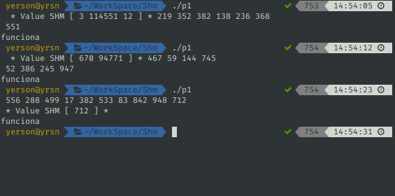
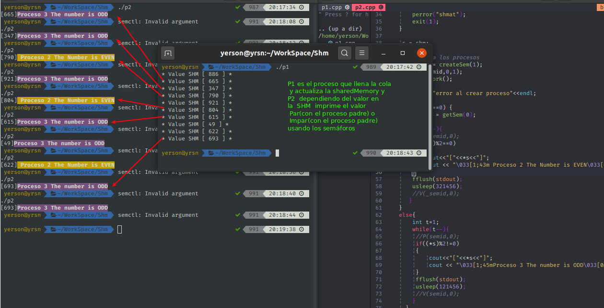

# queue shared memory and semaphore

### p1
~~~
El promagra para generar el los números aleatorios y 
almacenarlo en una cola y coloca valores en la memoria 
compartida. 
~~~ 

### p2
~~~
Tiene dos procesos que acceden a la memoria compartida
y dependiendo del número muestra en pantalla en amarillo
si es PAR i morado si es IMPAR 
~~~ 

### Run p1.cpp
~~~
g++ p1.cpp -o p1 -std=c++11 -pthread
~~~
### Run p2.cpp
~~~
g++ p2.cpp -o p2
~~~

### Test para la cola

### Ejecutamos el programa

~~~
Cada vez que p1 coloca un valor en la 
memoria compartida p2 lo recupera y 
evalua si es PAR o IMPAR
~~~